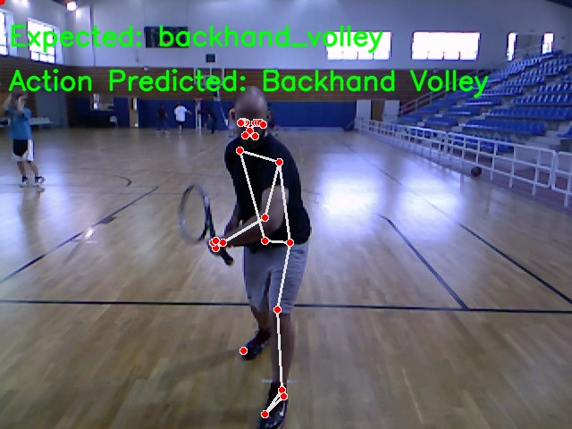

# Tennis Shot Action Recognition Using Pose Estimation and Bi-LSTM

## The system is designed to be used by tennis coaches and players to analyze their shots and improve their performance.

### Action Recognition with Human Pose


## Setup

To run the code, first download the folders, or clone the repository from GitHub. 
'''
git clone https://github.com/sandeeppvn/Action-Recognition-using-Human-Pose-Estimation.git
'''

Download data:
If Data folder or is not present, create one.
Download the dataset and extract the zip from the following link: http://thetis.image.ece.ntua.gr/
Place the VIDEO_RGB folder in the Data folder.

IMPORTANT
!!!Since the folder is large, Providing the VIDEO_RGB folder is difficult. Please download and extract the Data/VIDEO_RGB.zip at the same location before proceeding using the above instructions!!!

For a MAC, install Anaconda ARM64 version

Install Anaconda and create a new environment using the following command:
```
conda create -n myenv python=3.8
```

Activate the environment using the following command:
```
conda activate myenv
```

Install the required packages using the following command:
```
python setup.py
```

Run the file train.py using the following command:
```
python train.py
```

Additional arguments can be passed to the file to change the hyperparameters of the model.
The following arguments can be passed, all are optional:
• --lr: Learning rate
• --batch_size: Batch size
• --epochs: Number of epochs
• --num_layers: Number of LSTM layers
• --hidden_size: Number of hidden units in each LSTM layer
• --exp_name: Name of the experiment
• --pose_estimation: Pose estimation technique to use
• --action_recognition: Action recognition technique to use
• --input_path: Path to the input video file
• --sequences: Path to the sequences.npy file
• --labels: Path to the labels.npy file

Upon completion of training, the model will be saved in the saved_models folder as exp_name.h5 file.
The training plots and confusion matrix on the test set will be saved in plots folder as exp_name.png and exp_name_cm.png files respectively.

For Predicting the action of a video, run the file predict.py using the following command:
```
python predict.py --input_path <path to the input video file> --model_path <path to the saved model file>
```

The predicted action will be displayed on the terminal.
Additionally, a video with the prediction and the middle frame with pose and predicted shot will be saved in the results folder as <exp_name><file_name> +shot_prediction.jpg and <exp_name><file_name> +output.avi
